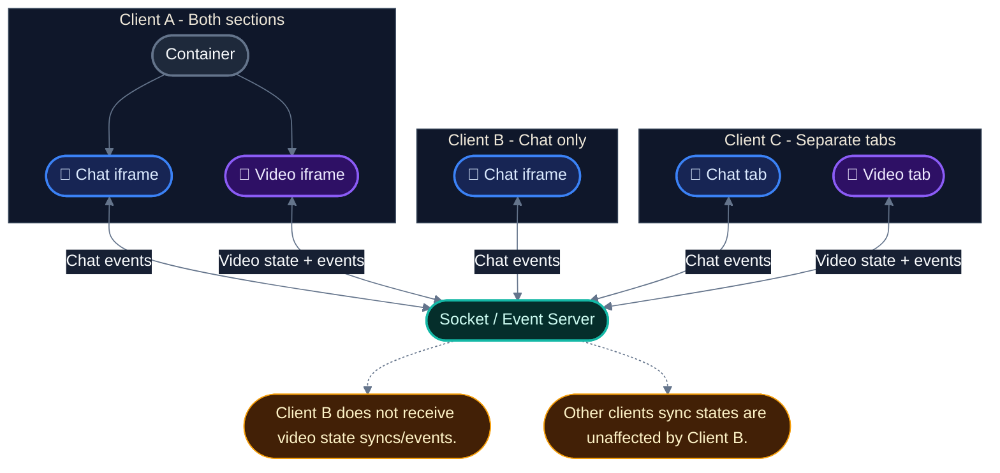

### The figure above shows the basic interaction set between `Chat` and `Video` sections, for each client.

:::caution
When in iframe mode (both section in one page), the sections communicate with `SendMessage`.

Some functionalities might break when `Video` section is missing a sibling `Chat` section.
:::