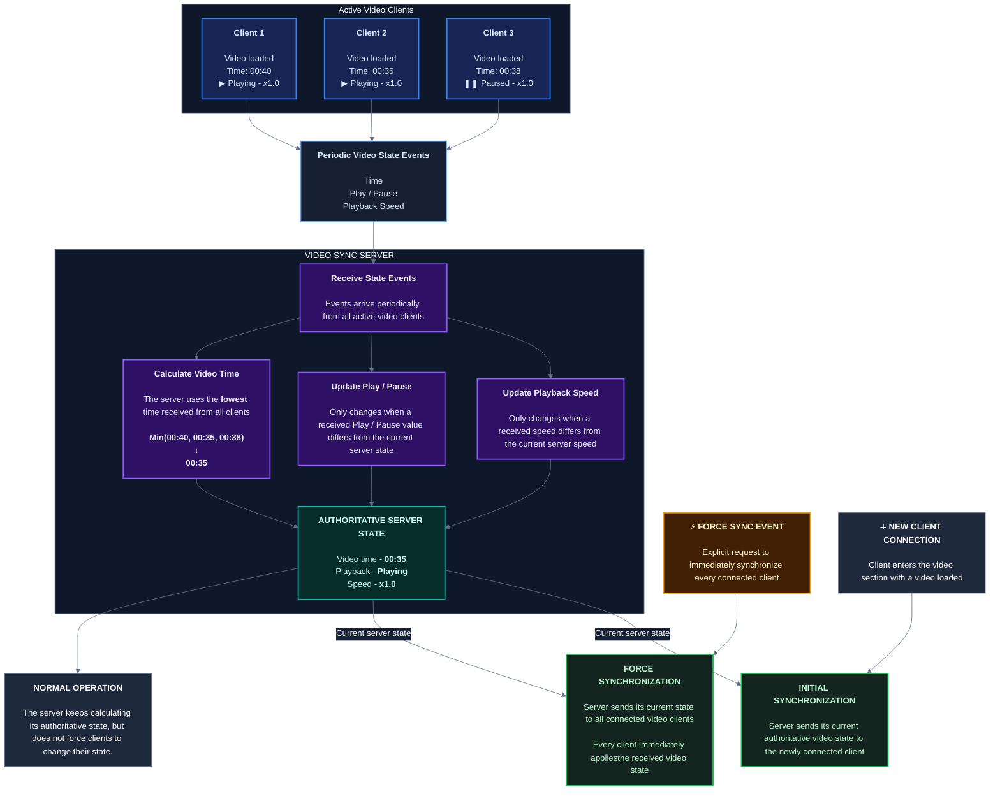

## Loading videos
---

There are currently two ways to load up a video in the player.

### Loading a local video
---

If you have a video file in your device's storage, you can choose this option and select the video accordingly.

:::important
Some old phones hardware do not natively support `x265` *(HEVC & Nvidia)* codec, therefore the browser cannot decode the video. 
This causes the player to freeze in a black screen, and play the video's audio instead.

Unfortunately, there is currently <u>no fix</u> for that. If your device seems to have this problem, you need to load up `x264` *(MPEG)* instead.
:::

### Loading from direct URL
---

If you have a link that directly shows / downloads the video upon opening, you can choose this option and fill in the prompt to try and stream the video online.

Using this method adds a little bit of overhead and might cause minor setbacks on an old device. This is because the network always has to send requests to fetch the URL as a `Partial Response`.

:::note
Some servers do not allow `Partial Response` requests and therefore a video stream cannot happen in the player.

In that case, you'll need to either wait for the whole video to get downloaded, or choose another server that supports that feature.
:::

## Loading subtitles
---

You can add a subtitle to video, which is automatically converted and fixed through the server.

### Uploading subtitles
---

If you have the `.srt` subtitle file in your device's storage, you can choose that file directly.

### Extracting subtitles
---

If you currently have a video loaded *(streaming & local)*, you can try and extract the embedded subtitles and route them through the server.

- Locally loaded video:
  
  The website tries loading a plugin called `FFmpeg-WASM`, which is a tool that reads your local file and finds its subtitles without uploading it anywhere.

  :::note
  The plugin is basically a `Web Assembly` with **~6MB** size. It will be automatically downloaded and stored in the static cache library for further usage.
  :::

- URL streaming video:
  
  The URL gets sent to the server first. Then, the server downloads *most* of the video to find its container's embedded subtitles section, and tries to extract them.

  This process is more complicated and might fail if the server fails to fetch the URL data. Therefore, your extraction process is visible on chat logs as a system notification.

  :::note
  This feature is rate-limited. If the server is failing to extract the subtitles, consider downloading a subtitle yourself and upload it using the first option.
  :::

## Video controls
---

Some side-gesture controls are available below.

### Resetting video
---

Pressing this button will `Reset` the video state. This includes:
1. Pausing the video
2. Setting video time to `00:00`
3. Removing the subtitle
4. Unloading the video
5. **Stopping a `Live Stream`**

### Playback speed
---

Sets the playback speed multiplier. This can <u>slow down</u> or <u>speed up</u> the playback.

:::note
Setting a high speed might cause the video to get de-synced due to high amount of time changes between clients.

At the same time, some high quality videos might not exactly get as fast as the desired amount. This is due to the hardware decoding <u>bottleneck</u>.
:::

### Playback volume
---

- Phone:
  
  Swipe from top to bottom, on the left side of the player to quickly change the video's volume.

- Desktop:
  
  Use mouse scroll to change the video's volume.

## Live streaming
---

Starting a `Live Stream` will change everyone's video source to the stream source.

- Camera sharing will start capturing your **Back** camera.

:::important
Unfortunately, phone browsers do not support sharing device's screen, therefore it is not possible to share your screen on phones.
:::

## State sync architecture
---

:::tip
You can compare the `Server Time` *(visible in player's bottom-down)* with your video's time to see if you're behind of forward. If the value differs more than ~5 seconds, you can press the sync button to force all clients to the server time.
:::