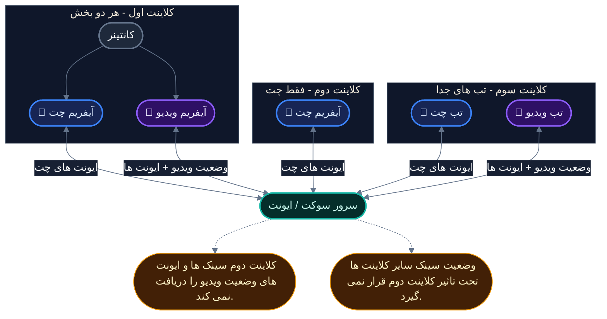

### تصویر بالا مجموعه تعاملات پایه بین بخش های `چت` و `ویدیو` را، برای هر کلاینت نشان می دهد.

:::caution
در حالت آیفریم (هر دو بخش در یک صفحه)، بخش ها با `SendMessage` با یکدیگر ارتباط برقرار می کنند.

اگر بخش `ویدیو`، یک بخش `چت` کنارش نباشد، ممکن است برخی از قابلیت های داخلی دچار مشکل شوند.
:::