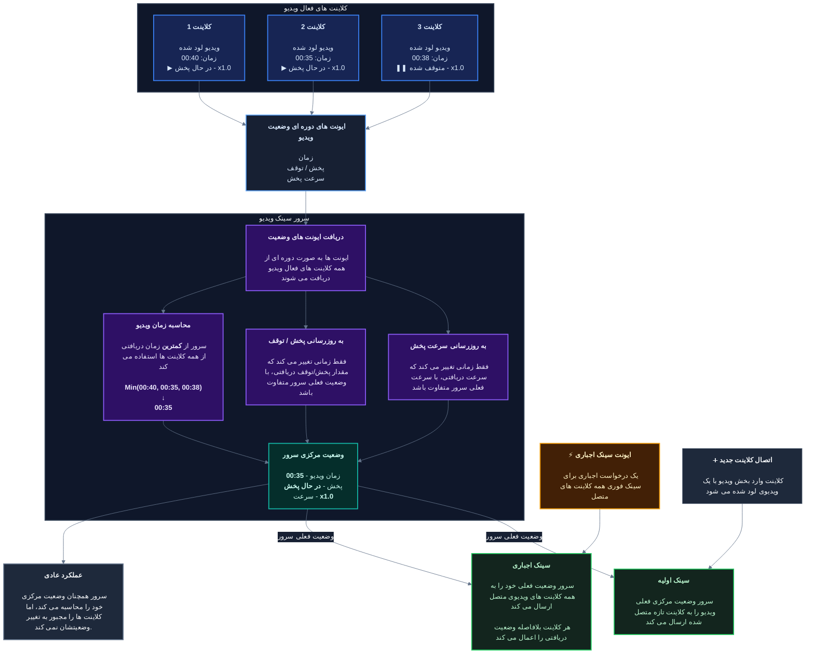

## لود کردن ویدیو
---

در حال حاضر دو راه برای لود کردن ویدیو در پلیر وجود دارد.

### لود کردن ویدیوی لوکال
---

اگر یک فایل ویدیو در حافظه دستگاه خود دارید، می توانید این گزینه را انتخاب و سپس ویدیو را انتخاب کنید.

:::important
سخت افزار برخی گوشی های قدیمی به صورت کامل از کدک `x265` *(HEVC و Nvidia)* پشتیبانی نمی کند، به همین دلیل مرورگر نمی تواند ویدیو را دیکد کند. 
این باعث می شود پلیر در یک صفحه سیاه فریز شود، و فقط صدای ویدیو پخش شود.

متاسفانه، در حال حاضر <u>هیچ راه حلی</u> برای این موضوع وجود ندارد. اگر دستگاه شما این مشکل را دارد، باید یک `x264` *(MPEG)* را لود کنید.
:::

### لود کردن از یک URL مستقیم
---

اگر یک لینک دارید که با باز شدنش مستقیما ویدیو را نشان می دهد یا دانلود می کند، می توانید این گزینه را انتخاب کنید و در پرامپت آن را وارد کنید تا برنامه تلاش کند ویدیو را به صورت آنلاین استریم کند.

استفاده از این روش مقداری سنگین تر است و ممکن است روی دستگاه های قدیمی مشکلات جزئی ایجاد کند. زیرا شبکه همیشه باید درخواستی برای دریافت URL به صورت `Partial Response` ارسال کند.

:::note
برخی سرورها اجازه درخواست های `Partial Response` را نمی دهند و به همین دلیل استریم ویدیو در پلیر امکان پذیر نیست.

در این حالت، باید یا صبر کنید تا کل ویدیو دانلود شود، یا لینک دیگری که سرور آن این قابلیت را پشتیبانی می کند انتخاب کنید.
:::

## لود کردن زیرنویس
---

می توانید یک زیرنویس به ویدیو اضافه کنید، که به صورت خودکار توسط سرور تبدیل و (درصورت خراب بودن) تعمیر می شود.

### آپلود کردن زیرنویس
---

اگر فایل زیرنویس `srt.` را در حافظه دستگاه خود دارید، می توانید مستقیم همان فایل را انتخاب کنید.

### استخراج زیرنویس
---

اگر در حال حاضر یک ویدیوی لود شده دارید *(استریم یا لوکال)*، می توانید سعی کنید زیرنویس های داخلی آن را استخراج کنید و از طریق سرور آن را آپلود کنید.

- ویدیوی لود شده لوکال:
  
  سایت سعی می کند یک پلاگین به نام `FFmpeg-WASM` را لود کند، که ابزاری است که فایل لوکال شما را می خواند و بدون اینکه آن را جایی آپلود کند، زیرنویسش را پیدا می کند.

  :::note
  این پلاگین اساسا یک `Web Assembly` با حجم **6~ مگابایت** است. آن به صورت خودکار دانلود می شود و در کتابخانه کش استاتیک برای استفاده های بعدی ذخیره می شود.
  :::

- ویدیوی استریم شده از URL:
  
  ابتدا URL به سرور ارسال می شود. سپس، سرور *بیشتر* ویدیو را دانلود می کند تا بخش زیرنویس های داخلی در محتوای آن را پیدا کند، اگر موفق شد، سعی می کند آن را استخراج کند.

  این فرآیند پیچیده تر است و ممکن است اگر سرور نتواند داده URL را دریافت کند، شکست بخورد. به همین دلیل، فرآیند استخراج شما به صورت یک نوتیفیکیشن سیستمی در لاگ های چت قابل مشاهده است.

  :::note
  این قابلیت `محدودیت پاسخگویی` دارد. اگر سرور نمی تواند زیرنویس را استخراج کند، بهتر است خودتان یک زیرنویس دانلود کنید و با گزینه اول آپلود کنید.
  :::

## کنترل های ویدیو
---

چند کنترل انگشتی از کنار صفحه، جهت آسان کردن کار در ادامه موجود است.

### ریست کردن ویدیو
---

با زدن این دکمه، وضعیت ویدیو `ریست` می شود. این موارد را هم شامل می شود:
1. متوقف کردن ویدیو
2. تنظیم زمان ویدیو به `00:00`
3. حذف زیرنویس
4. برداشتن ویدیو از روی پلیر
5. **متوقف کردن `لایو استریم`**

### سرعت پخش
---

ضریب سرعت پخش را تنظیم می کند. این می تواند پخش را <u>کند تر</u> یا <u>سریع تر</u> کند.

:::note
تنظیم سرعت بالا ممکن است باعث شود ویدیو به دلیل تغییرات زیاد زمانی بین کلاینت ها، از سینک خارج شود.

در عین حال، برخی ویدیوهای با کیفیت بالا ممکن است دقیقا به همان سرعت مورد نظر نرسند. این به دلیل <u>باتل نک</u> (رسیدن به حداکثر توان سخت افزاری) دیکد است.
:::

### صدای پخش
---

- گوشی:
  
  انگشت خود را در سمت چپ پلیر، بالا و پایین کنید تا صدای ویدیو سریعا تغییر کند.

- دسکتاپ:
  
  از اسکرول موس استفاده کنید تا صدای ویدیو کم یا زیاد شود.

## لایو استریم
---

شروع یک `لایو استریم`، منبع ویدیوی همه را به منبع استریم تغییر می دهد.

- شیر کردن دوربین، از دوربین **عقب** شما استفاده می کند.

:::important
متاسفانه، مرورگرهای گوشی از شیر کردن صفحه دستگاه پشتیبانی نمی کنند، به همین دلیل شیر کردن صفحه روی گوشی امکان پذیر نیست.
:::

## معماری سینک وضعیت
---

:::tip
می توانید `Server Time` *(که در پایین-وسط پلیر قابل مشاهده است)* را با زمان ویدیوی خود مقایسه کنید تا ببینید عقب هستید یا جلو. اگر اختلاف زمانی بیشتر از 5~ ثانیه بود، می توانید دکمه سینک را بزنید تا همه کلاینت ها دوباره زمانی برابر با همدیگر داشته باشند.
:::